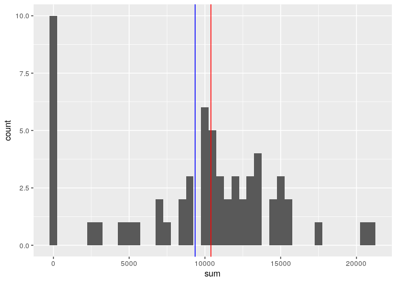
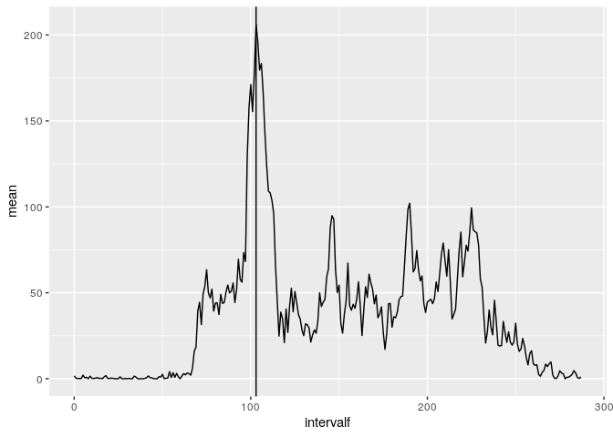

```r
library(dplyr)
```

```
## 
## Attaching package: 'dplyr'
```

```
## The following objects are masked from 'package:stats':
## 
##     filter, lag
```

```
## The following objects are masked from 'package:base':
## 
##     intersect, setdiff, setequal, union
```

```r
library(ggplot2)
```

## Loading and preprocessing the data

```r
data <- read.csv("activity.csv")
```

## What is mean total number of steps taken per day?


```r
sum_steps_by_day <- data %>% 
  group_by(date) %>% 
  summarise(sum = sum(steps, na.rm = TRUE))
mean_daily_steps <- mean(sum_steps_by_day$sum, na.rm = TRUE)
median_daily_steps <- median(sum_steps_by_day$sum, na.rm = TRUE)
ggplot(sum_steps_by_day, aes(x = sum)) + geom_histogram(binwidth = 500) + geom_vline(xintercept = mean_daily_steps, colour="blue") + geom_vline(xintercept = median_daily_steps, colour="red")
```

<!-- -->

## What is the average daily activity pattern?

```r
steps_per_interval <- data %>% 
     mutate(intervalf = interval%/%100 * 12 + interval%%100 / 5) %>%
     group_by(intervalf) %>%
     summarise(mean = mean(steps, na.rm = TRUE))
max_steps_interval <- steps_per_interval %>% top_n(n=1)
```

```
## Selecting by mean
```

```r
ggplot(steps_per_interval, aes(x = intervalf, y = mean)) + geom_line() + geom_vline(xintercept = max_steps_interval$intervalf)
```

<!-- -->

## Imputing missing values

```r
total_na_num <- sum(is.na(data$steps))
mean_steps_by_interval <- data %>%
     group_by(interval) %>%
     summarise(mean = mean(steps, na.rm = TRUE))
new_data <- data %>% mutate(steps = ifelse(is.na(steps), (mean_steps_by_interval %>% filter(interval == interval))$mean, steps))
new_sum_steps_by_day <- new_data %>% 
     group_by(date) %>% 
     summarise(sum = sum(steps, na.rm = TRUE))
new_mean_daily_steps <- mean(new_sum_steps_by_day$sum, na.rm = TRUE)
new_median_daily_steps <- median(new_sum_steps_by_day$sum, na.rm = TRUE)
ggplot(new_sum_steps_by_day, aes(x = sum)) + geom_histogram(binwidth = 500) + geom_vline(xintercept = new_mean_daily_steps, colour="blue") + geom_vline(xintercept = new_median_daily_steps, colour="red")
```

<!-- -->

## Are there differences in activity patterns between weekdays and weekends?


```r
options(dplyr.summarise.inform = FALSE)
new_data$weekday <- as.factor(ifelse(weekdays(as.Date(data$date)) %in% c("Saturday", "Sunday"), "weekend", "weekday"))
d <- new_data %>%
     mutate(intervalf = interval%/%100 * 12 + interval%%100 / 5) %>%
     group_by(intervalf, weekday) %>%
     summarise(mean_steps = mean(steps))
ggplot(data = d, aes(x = intervalf, y = d$mean_steps)) + geom_line() + facet_grid(weekday ~ .)
```

<!-- -->
